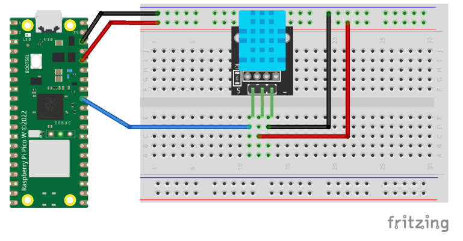
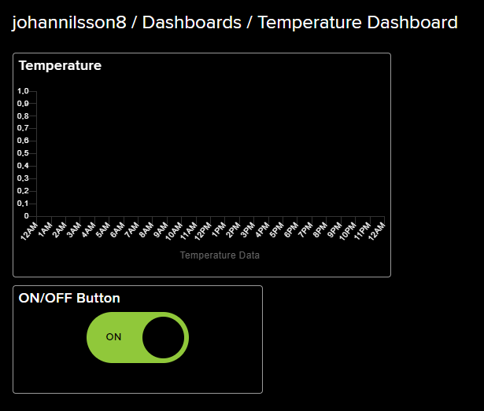
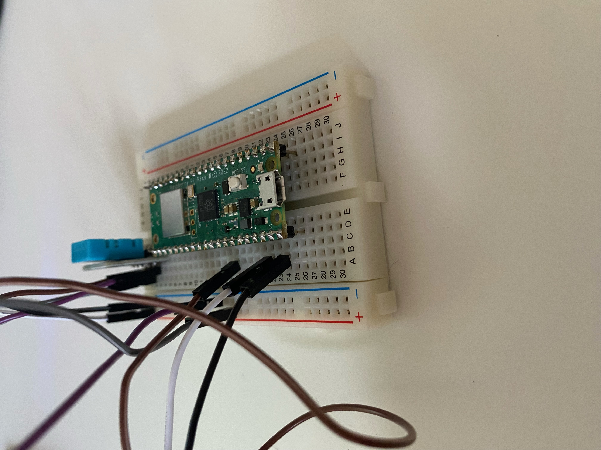

# Tutorial on how to build and connect a temperature sensor to IoT
Author: Johan Nilsson / jn223yw

Short Overview: This is a project for the IoT Summer Course 2023 @ LNU, which allows you to both build and connect a temperature sensor with Wi-fi, to IoT.

Time: 20 minutes

# Objective
I chose this project because I wanted something simple, which provided me as much as possible. The purpose of this device is to measure the temperature inside a room where the wine fermentation is done while making your own wine. It is very important that the temperature is between 20-32 celcius in order to keep the wine healthy, which is easier said than done in an apartment without Aircondition during the summer and winter. The data will provide the temperature every five minutes, which allows you to guarantee that your wine has been in the optimal temperature during the whole fermentation process, and also allows you to adjust the temperature on beforehand, by seeing if the temperature goes close to 20 or 32 celcius. The insights this will give is the optimal way to ensure that the temperature is okay during the whole process, and will hopefully make you learn how to keep it okay without having to check the temperature. 

# Materials
|Item|Specifications|Cost|
|:----:|:----:|:----:|
|[Raspberry Pi Pico WH](https://www.electrokit.com/produkt/raspberry-pi-pico-wh/)|The Brain|109 SEK|
|[Breadboard (400 connections)](https://www.electrokit.com/produkt/kopplingsdack-400-anslutningar/)|Allows wiring between components|49 SEK|
|[USB -> USB-C Cable](https://www.electrokit.com/produkt/usb-kabel-a-hane-micro-b-5p-hane-1-8m/)|Connects Raspberry Pi Pico WH to your computer|39 SEK|
|[Wires (Male to Male)](https://www.electrokit.com/produkt/labbsladd-20-pin-15cm-hane-hane/)|Wires to connect components|29 SEK|
|[DHT11 Digital temperature- and humiditysensor](https://www.electrokit.com/produkt/digital-temperatur-och-fuktsensor-dht11/)|Sensors to gather data|49 SEK|
|Powerbank|Powers the Raspberry Pi Pico W||

# Putting everything together
## Hardware
In order to get started with this project, you have to set up and download a couple of things. First of all we need to set up everything on a Raspberry Pi Pico W board by following this image which is provided from another [tutorial](https://hackmd.io/@lnu-iot/r1U1bPgw2) created by the wonderful staff at LNU. The position of the Sensor and Raspberry Pi Pico W board does not matter, you can place it wherever you want as long as the wires go from the right places:


When you have saved the code to your Raspberry Pi Pico W later, you will connect your powerbank to the Pico W, instead of having the Pico W connected to your PC

## Firmware
This project also needs you to have MicroPython installed on your Raspberry Pi Pico W board. You can download MicroPython with Wi-Fi support [here](https://www.raspberrypi.com/documentation/microcontrollers/micropython.html).
Once you have this downloaded MicroPython to your computer, you can follow this GIF that shows instructions on how to install MicroPython on your Raspberry Pi Pico W 


# Computer setup 
## Coding environment
The IDE for this project is Thonny. Thonny is a beginner-friendly Python IDE, which makes it easy to understand and getting started with IoT.
In order to get started with this project, you have to set up and download a couple of things. These are: 
1. Download Thonny at (https://thonny.org/)

When you successfully downloaded Thonny, you can go ahead and open it up for the first time.
Now navigate to "Tools" and click on "Manage Packages". You now have to download "picozero".

When this is downloaded, you can proceed to the next step of the project.

## How the code is uploaded
In order to upload the code to your Raspberry Pi Pico W later on, you will click on "Save File" or "Ctrl + Shift + S", and chose "Raspberry Pi Pico". This will upload the file to your Raspberry Pi.

# Platform
The platform used for this project is [adafruit](https://io.adafruit.com/).
Adafruit is a simple way to visualize the data which your sensor is going to gather, using MQTT & Webhooks. Here you need to create a free account, and you can then follow the instructions on this [link](https://core-electronics.com.au/guides/getting-started-with-mqtt-on-raspberry-pi-pico-w-connect-to-the-internet-of-things/) which shows you exactly how to create a dashboard and data flows, which you will connect with your code in order to display all of your gathered data. 

In terms of funtionality, the site allows you to create a dashboard and data flow, as earlier mentioned. The dashboard will show you a graph, where the temperature will be displayed, together with what time the temperature got gathered. The dashboard will also contain an ON/OFF Button, which will allow you to turn the device ON and OFF.
The graphs gets the data from something called a "data flow", which is the thing that will get all of the data from your Raspberry Pi Pico W, to the website. 
Adafruit is fully cloud-based, which means that you dont have to host anything locally for this, it will take care of itself.

# The code
The code for this project consists of a few main functions. The first one being to import all of the necessary libraries, and connecting the device to your Wi-Fi. Digging into the code, the first part of the code imports all of the libraries, such as network which allows you to use Wi-Fi, MQTTClient which allows you to connect with Adafruit, Picozero which you downloaded earlier, and also Pin from your device which controls the light.

The next part of the code provides your device with all of your Wi-Fi information, and then creates a wlan in order to connect to your Wi-Fi. The code also contains a couple of prints, which is helpful when testing. 
## Import and Wi-Fi connection
```
import network
import time
from umqtt.simple import MQTTClient
from picozero import pico_temp_sensor
from machine import Pin

#Setup LED
led = Pin('LED', Pin.OUT)


# WiFi name and password
wifi_ssid = "*The name of your Wi-Fi"
wifi_password = "The password of your Wi-Fi"


# Connect to WiFi
wlan = network.WLAN(network.STA_IF)
wlan.active(True)
wlan.connect(wifi_ssid, wifi_password)
while wlan.isconnected() == False:
    print('Waiting for connection...')
    time.sleep(5)
print("Connected to WiFi")
```
## Adafruit Connection
The following code connects your device to Adafruit, which is going to visualize your data, as mentioned earlier. The code firstly provides your device with all of the Adafruit details, and then connects to the MQTT server which is used.
```
# Adafruit IO Details
mqtt_host = "io.adafruit.com"
mqtt_username = "*Adafruit Username"  # Username
mqtt_password = "*Adafruit Key"  # Key
mqtt_publish_topic = "*Adafruit Publish Topic*"  # MQTT Publish Topic
mqtt_subscribe_topic = "*Adafruit Subscribe Topic*" # MQTT Subscribe Topic


# Unique ID 
mqtt_client_id = "TotallyUniqueIDforMyIoTProjectSummer23"


# Initialize and connect to the MQTT server
mqtt_client = MQTTClient(
        client_id=mqtt_client_id,
        server=mqtt_host,
        user=mqtt_username,
        password=mqtt_password)
```
## Data gathering
The most important part of the code, which may be the part which is the easiest one to understand, is the data gathering. This code tries to gather the data from the temperature sensor, publish it to Adafruit so that you can see it in your beautiful graph, and then waits for 300 seconds (5 minutes), before it gets the temperature once again. 

As you maybe have noticed in the code, you can see that the temperature is gathered from something called pico_temp_sensor.temp. Here you can see what we used Picozero for, which you downloaded earlier! 
```
try:
    while True:
        # Gathers data from the temperature sensor
        temperature = pico_temp_sensor.temp
        
        # Publish the data to the topic
        print(f'Publish {temperature:.2f}')
        mqtt_client.publish(mqtt_publish_topic, str(temperature))
        
        # Delay
        time.sleep(300)
        
except Exception as e:
    print('Failed to publish message')
```

# Transmitting the data / connectivity
As mentioned earlier, the data is sent every 5 minutes. This can be adjusted to whatever you prefer by changing the number in "time.sleep(300)", to your prefered time in seconds. 

The wireless protocol used for this project is Wi-Fi. The reason behind this choice is simply because it is something that the majority of people have at home, which makes this project accessable for a large amount of people, and it is also something that most people have a somewhat understanding of how it works, compared to other alternatives. It makes the tutorial easy to get a grasp of, and easy to get on with. 

The chosen transport protocol for the project is MQTT & Webhooks. This is simply because I prefer Adafruit, and also think that it would be easy for a beginner to grasp, both the website and the code which is needed in order to connect. 

# Presenting the data
The Dashboard is built with 2 different components. One graph and one button. 
The graph saves when the data is gathered and displays it as the x-axis, and it also saves the temperature and displays it as the y-axis. The data is saved every time the device sends data, which is every 5 minutes, and preserves it for 30 days, since a free subscription is used for this project. The dashboard also contains a button, which simply allows you to turn the device ON and OFF by clicking it. 

Here are a picture of the dashboard:



# Finalizing the design
The final design of the project is a wireless board, which gathers temperature data and sends it to Adafruit every 5 minutes for visualization by using Wi-Fi Connection. 

I personally think that the project went great. I have been programming for 6 years now, and three of them being at BTH as a Master of Science in Engineering: Software Engineering student, which did make the coding part of this project fairly easy. Even though I found the coding part easy, it was a very fun project to create, and I also learned a lot of new things about how to apply IoT, and also how much potential things you could possibly do with it. The only thing I would have done different is that I would have chosen a more complex project, but since I am currently working 8 hours a day I did not want to risk not having enough time to finish it, and therefore went with this one. I would also have used VSCode, since Thonny gave me some headache from time to time. Overall I think that the course and the project was great, especially all of the teachers which provided help within 5 minutes all day all night. 

Here is a picture of the project: 


